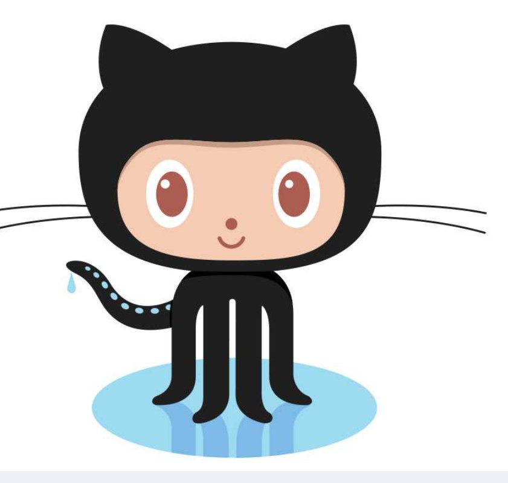

<div align="center">

  

  <br/><br/>

  <table border="0" cellpadding="0" cellspacing="20"><tr>
    <td align="center"></td>
    <td align="center"></td>
    <td align="center"></td>
  </tr></table>

  <br/>

  
  
  

</div>

---


## 🌟 About Me

```python
sonika = {
    "name"      : "Sonika Deshwal",
    "role"      : "AI & ML Developer | CS Student",
    "university": "Lovely Professional University",
    "batch"     : "2023 - 2027",
    "portfolio" : "sonikadeshwal.netlify.app",
    "currently" : ["Machine Learning", "Deep Learning", "Model Deployment"],
    "passion"   : "Building real-world AI that makes a difference 🚀"
}
```

🔹 Learning **Machine Learning** & **Deep Learning**  
🔹 Building **real-world AI projects**  
🔹 Exploring **Data Science** & **Model Deployment**  
🔹 Passionate about **NLP**, **Computer Vision** & **Fraud Detection**

---

## 🔗 Connect With Me & Portfolio

<div align="center">

[](https://sonikadeshwal.netlify.app)
[](https://linkedin.com/in/sonikadeshwal/)
[](https://leetcode.com/u/Sonika_Deshwal/)
[](https://www.geeksforgeeks.org/profile/sonikadesxdpn)
[](https://www.hackerrank.com/profile/sonikadeshwal412)
[](https://instagram.com/100nikadeshwal)
[](mailto:sonikadeshwal412@gmail.com)

</div>

---

## 💻 Tech Stack

<div align="center">

**Languages**  


**ML / Data Science**  


**Tools & Platforms**  


</div>

---

## 📊 GitHub Stats

<div align="center">


<br/>


</div>

---

## 🏆 GitHub Trophies

<div align="center">


</div>

---

## 🚀 Featured Projects

<div align="center">

| 🧠 Project | 📝 Description | 🛠 Tech |
|---|---|---|
| [🤖 Smart AI Interview Coach](https://github.com/sonikadeshwal/Smart-AI-Interview-Coach) | AI-powered mock interview simulator with role-based Q&A | Python, Streamlit, NLP |
| [🔍 Fake Account Detection](https://github.com/sonikadeshwal/Social-Media-Fake-Account-Detection) | ML system to detect fraudulent social media accounts | Python, Scikit-learn, Pandas |
| [📧 Smart Email Classifier](https://github.com/sonikadeshwal/Smart-Email-Classifier) | NLP classifier with 89% accuracy — Spam/Promo/Urgent | Python, TF-IDF, Naive Bayes |
| [📊 E-Commerce Dashboard](https://github.com/sonikadeshwal/E-Commerce-Sales-Analytics-Dashboard-) | Interactive sales analytics with SQL-backed insights | Python, SQL, Streamlit |

</div>

---

<div align="center">

[](https://visitcount.itsvg.in)

<br/>


&nbsp;&nbsp;

&nbsp;&nbsp;


<br/>

*✨ "Code is my superpower — building the future one model at a time." ✨*

</div>
